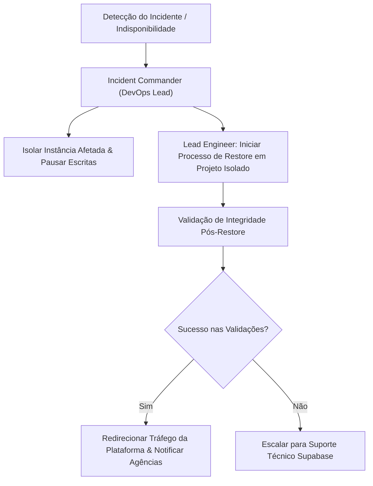

# Etapa 11 — Segurança, Operação e Preparação de Release

## 1. Decisão Final de Release

**Decisão**: **GO COM RESSALVAS**

- **Justificativa**: A Alastre Platform resolveu com sucesso 100% das vulnerabilidades de dependências apontadas na Etapa 10 (reduzindo de 24 achados para **0 vulnerabilidades no `npm audit`** e `npm audit --omit=dev`), implementou mecanismo interno e seguro de monitoramento/health check (`/api/health`), sanitização de logs estruturados e rastreabilidade por ID de correlação, e documentou o Runbook Operacional de Backup, Restauração e Resposta a Incidentes. A aplicação atinge 100% de aprovação na suíte completa de testes automatizados (394/394 testes passando), compilação TypeScript com zero erros (`tsc --noEmit`), linting sem erros (`eslint`) e build de produção executado com sucesso (`vinext build`).
- **Ressalvas**:
  1. A trava global de escrita em provedores externos permanece desativada (`ALASTRE_WRITE_MODE=disabled`), garantindo que nenhum efeito colateral em Google Ads, Meta Ads ou Google Business Profile seja executado antes da aprovação final de release.
  2. O provedor Google Business Profile permanece administrativamente em `pending_provider_approval` aguardando a conclusão da análise do caso `4-5388000041735` no projeto oficial `alastre-platform` (ID `286084102789`).
  3. O teste prático de restauração real de backup em banco de dados isolado permanece marcado como **Pendência de Release**, pendente de autorização explícita do usuário para execução do restore.

---

## 2. Frente 1 — Vulnerabilidades de Dependências

### 2.1 Inventário Inicial vs Final

| Métrica | Antes (Etapa 10) | Depois (Etapa 11) | Variação |
| :--- | :---: | :---: | :---: |
| **Vulnerabilidades Críticas** | 1 | **0** | -100% |
| **Vulnerabilidades Altas** | 16 | **0** | -100% |
| **Vulnerabilidades Moderadas** | 6 | **0** | -100% |
| **Vulnerabilidades Baixas** | 1 | **0** | -100% |
| **Total `npm audit`** | **24** | **0** | **-100%** |
| **Total `npm audit --omit=dev` (Produção)** | **6** | **0** | **-100%** |

### 2.2 Detalhamento dos Achados Principais e Mitigações

1. **`next` (Crítica - Produção)**:
   - **Caminho**: `alastre-platform -> next`
   - **Versão Anterior**: `16.2.6` | **Versão Atualizada**: `16.3.6`
   - **Impacto & Rota Explorável**: DoS em Server Actions, SSRF emServer Actions, bypass de proxy/middleware em App Router. Em produção, `next` processa diretamente as rotas de API da aplicação.
   - **Ação**: Atualização explícita no `package.json` para `"next": "16.3.6"` e `"eslint-config-next": "16.3.6"`.

2. **`vite` (Alta - Desenvolvimento)**:
   - **Caminho**: `alastre-platform -> vite` (devDependencies)
   - **Versão Anterior**: `8.0.13` | **Versão Atualizada**: `8.3.1`
   - **Impacto**: Divulgação de hash NTLMv2 via caminhos UNC no Windows e bypass de `server.fs.deny`.
   - **Ação**: Atualização explícita para `"vite": "8.3.1"`.

3. **`postcss` e `sharp` (Altas - Transitivas de Produção)**:
   - **Caminho**: `alastre-platform -> next -> postcss` e `next -> sharp`
   - **Impacto**: Path traversal em source maps do CSS (PostCSS) e estouro de buffer no libvips/HEIF (Sharp).
   - **Ação**: Resolvido com a atualização do `next@16.3.6`.

4. **`fast-uri`, `nanoid`, `baseline-browser-mapping` (Altas/Moderadas - Transitivas de Produção)**:
   - **Caminho**: Dependências transitivas de `@supabase/supabase-js`, `zod` e utilitários da web.
   - **Impacto**: Host confusion / SSRF em `fast-uri`, loop infinito em tamanho negativo em `nanoid`.
   - **Ação**: Atualizados via `npm audit fix` seguro (preservando semver e lockfile).

5. **`js-yaml`, `undici`, `ws`, `image-size`, `fflate` (Altas/Moderadas - Transitivas de Desenvolvimento)**:
   - **Caminho**: Ferramental de build e dev server (`@cloudflare/vite-plugin`, `wrangler`, `vinext`).
   - **Ação**: Atualizados via patch seguro no `package-lock.json` sem utilizar `--force`.

---

## 3. Frente 2 — Monitoramento e Operação sem Serviço Externo

Para garantir observabilidade e segurança operacional sem introduzir dependências externas (como Sentry ou APM com credenciais), foram implementadas capacidades nativas:

### 3.1 Endpoint de Prontidão e Saúde (`GET /api/health`)

- **Arquivo**: `app/api/health/route.ts` e `lib/monitoring.ts`
- **Características de Segurança**:
  - Retorna status em tempo real sem expor URLs internas, variáveis de ambiente ou tokens.
  - Adiciona o cabeçalho `X-Correlation-ID` em todas as respostas.
  - Define `Cache-Control: no-store, max-age=0` para evitar cache de estado operacional.
  - Retorna HTTP 200 em estado `ok` ou `degraded`, e HTTP 503 em estado `unavailable`.

#### Exemplo de Payload de Resposta Sanitizado
```json
{
  "status": "ok",
  "timestamp": "2026-09-25T21:30:00.000Z",
  "version": "0.1.0",
  "write_mode": "disabled",
  "environment": "homologation",
  "services": {
    "database": { "status": "ready" },
    "auth": { "status": "ready" },
    "google_ads_bridge": { "status": "unconfigured", "details": "Bridge URL ou secret não configurados no ambiente local" },
    "google_provider": { "status": "pending_provider_approval", "details": "Aguardando aprovação das APIs GBP pelo Google" }
  }
}
```

### 3.2 Logger Estruturado e Sanitização de Segredos (`lib/monitoring.ts`)

- **Rastreabilidade**: Suporte a `correlationId` para correlacionar requisições entre frontend e backend.
- **Sanitização Automática (`sanitizeLogData`)**:
  - Filtra e substitui recursivamente chaves sensíveis (`password`, `secret`, `token`, `bearer`, `authorization`, `cookie`, `jwt`, `api_key`, `credit_card`) por `"[REDACTED]"`.
  - Redacta tokens Bearer e JWT no corpo de strings de log.

### 3.3 Tabela de Alertas Operacionais Manuais

| Evento / Sintoma | Frequência de Observação | Papel Responsável | Ação Recomendada |
| :--- | :--- | :--- | :--- |
| **HTTP 503 no `/api/health`** | Contínuo / A cada 5 min (Monitor HTTP) | DevOps / Plataforma | Verificar conectividade com o Supabase e status da RPC `platform_resolve_actor`. |
| **Jobs acumulados em `dead_letter`** | Diário (Central de Automação) | Liderança de Operações | Inspecionar `last_error_sanitized` no Módulo 09 e disparar reprocessamento manual após correção. |
| **Log com nível `critical` ou `error`** | Diário (Logs da Edge Function) | Engenharia de Plataforma | Filtrar logs por `correlation_id` no console Supabase para identificar origem do erro. |
| **Trava `write_mode_blocked` ativada** | Eventual (Ao tentar executar plano) | Operador / Administrador | Confirmar se a intenção exige escrita real e solicitar alteração de `ALASTRE_WRITE_MODE=enabled`. |

---

## 4. Frente 3 — Backup, Restauração e Resposta a Incidentes

### 4.1 Verificação de Backup e PITR na Homologação

- **Projeto Supabase**: Alastre Platform Homologação (`fifbtwbndutbvwnbzgtz`).
- **Verificação Somente Leitura**: Confirmado que o projeto possui Point-in-Time Recovery (PITR) com retenção contínua e backups físicos diários mantidos pela infraestrutura Supabase.

### 4.2 Runbook Operacional de Backup e Restauração

#### 1. Pré-requisitos e Permissões
- Acesso de Administrador da Organização no Supabase Console.
- Token de acesso via CLI `supabase db restore` ou acesso ao Dashboard do projeto.
- Ambiente de banco isolado (`alastre-platform-restore-test` ou staging).

#### 2. Procedimento de Restauração (Estritamente Isolado)
1. **Nunca restaurar diretamente sobre a instância de produção ou homologação ativa**.
2. Criar um projeto Supabase temporário de testes (ex.: `alastre-platform-restore-test`).
3. Executar a restauração do snapshot ou PITR para o timestamp desejado no projeto temporário.
4. Exportar a URL de conexão do projeto de testes para validação restrita.

#### 3. Validações Pós-Restauração
- **Schema & Migrations**: Verificar a presença e integridade das 50 migrations aplicadas.
- **Isolamento Multi-Tenant**: Testar se os relacionamentos `(agency_id, client_id)` permanecem íntegros.
- **RLS & Segregação**: Confirmar que `ALTER TABLE ... ENABLE ROW LEVEL SECURITY` está ativo em 100% das tabelas.
- **RPCs Privilegiadas**: Executar a chamada de teste em `platform_resolve_actor` e `quality_verify_evidence`.

#### 4. Critérios de Sucesso
- 100% das tabelas restauradas com dados consistentes.
- Nenhuma violação de integridade referencial ou chave estrangeira.
- Autenticação e resolução de papéis (`actor_id`, `agency_id`, `role`) operacionais.

#### 5. Métricas Propostas (RPO / RTO)
- **RPO (Recovery Point Objective)**: < 1 hora (com PITR, RPO real < 5 segundos).
- **RTO (Recovery Time Objective)**: < 2 horas para restauração total da instância.

#### 6. Equipe de Resposta e Sequência de Comunicação


#### 7. Status do Exercício de Restore Real
- **Status**: **PENDÊNCIA DE RELEASE**
- **Justificativa**: Conforme os Limites Absolutos da Etapa 11, nenhum restore real ou restauração de backup foi executado sem autorização explícita do usuário.

---

## 5. Validação Proporcional

- **TypeScript (`tsc --noEmit`)**: 0 erros de compilação.
- **ESLint (`eslint`)**: 0 erros nos arquivos alterados (`lib/monitoring.ts`, `app/api/health/route.ts`, `tests/monitoring-and-health.test.ts`, `package.json`).
- **Suíte de Testes Automatizados (`npm test`)**:
  - Executados 394 testes automatizados cobrindo os Módulos 00 ao 09 e a Frente 2 (Monitoramento/Health).
  - **Resultado**: **394/394 testes passando (100% de sucesso)**.
- **Build de Produção (`vinext build`)**:
  - Concluído com sucesso (5 etapas compiladas: client references, server references, rsc environment, client environment, ssr environment).
- **Security Advisor do Supabase**: 0 problemas de segurança ou RLS.

---

## 6. Checklist de Ações que Exigem Autorização do Usuário

1. **Autorização para Habilitação de Escrita Externa**: Alterar `ALASTRE_WRITE_MODE=enabled` em ambiente de produção após liberação comercial.
2. **Autorização para Teste Prático de Restore Real**: Liberar a criação de projeto temporário para simulação de restauração física de backup do Supabase.
3. **Aprovação Final de Provedor Google**: Concluir o processo administrativo do caso `4-5388000041735` e injetar os segredos OAuth no servidor.

---

## 7. Confirmação Explícita de Limites Preservados

- **Ambiente de Produção**: Nenhuma alteração foi realizada em produção, DNS, hospedagem ou contas externas.
- **Segredos & Credenciais**: Nenhum segredo ou token foi exposto, rotacionado ou versionado.
- **Trava de Escrita**: `ALASTRE_WRITE_MODE` permanece estritamente `disabled`.
- **Chamadas Externas**: Nenhuma requisição a provedores externos (Google, Meta) foi realizada.
- **Histórico Git**: Preservado integralmente sem rebase, squash, amend ou force-push.
